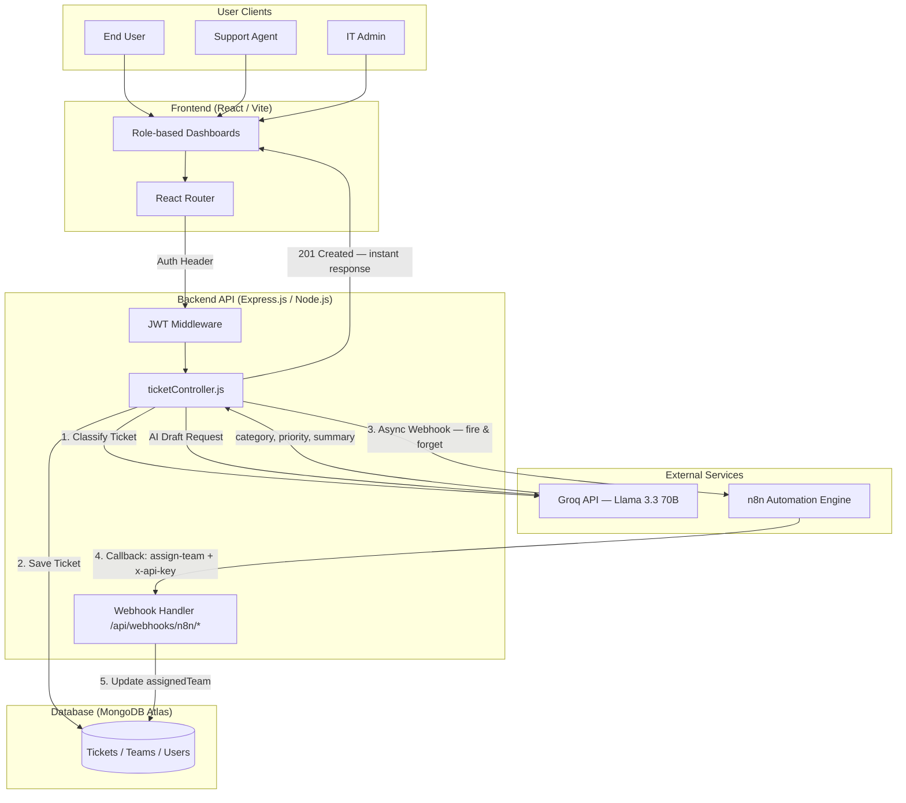

# Deskline — Intelligent IT Helpdesk & Automation Platform

Deskline is a full-stack MERN (MongoDB, Express, React, Node.js) IT Helpdesk Ticketing System engineered with **role-based access control**, **AI-driven ticket triage** powered by the **Groq API (Llama 3.3 70B)**, and **event-driven team routing** automated via the **n8n Automation Engine**.

By intercepting every ticket submission, Deskline automatically classifies the category and priority using an LLM, asynchronously fires a webhook to n8n, which routes the ticket to the correct support team and calls back the backend to complete assignment — all without any manual coordinator involvement.

---

## 📸 Application Screenshots

### 🖥️ User Dashboard (Submit & Track Tickets)

<p align="center">
  
</p>

<p align="center">
<i>End-user dashboard for submitting support tickets and tracking their resolution status in real time.</i>
</p>

---

### 🛠️ Agent Dashboard (Team Queue & AI Reply Drafts)

<p align="center">
  
</p>

<p align="center">
<i>Agent view filtered to their team's assigned ticket queue, with AI-powered reply draft generation and SLA breach indicators.</i>
</p>

---

### 👑 Admin Dashboard (Full System Control)

<p align="center">
  
</p>

<p align="center">
<i>Administrator control panel with category analytics, full ticket visibility across all teams, user management, and team administration.</i>
</p>

---

### 🎫 Ticket Detail (AI Summary, SLA Badge & Status Management)

<p align="center">
  
</p>

<p align="center">
<i>Individual ticket view displaying the AI-generated summary, priority badge, SLA breach status, assigned team, and the AI reply draft tool for agents.</i>
</p>

---

## 🚀 Key Features

* **AI Ticket Triage**: On every ticket submission, Groq's Llama 3.3 70B instantly classifies the `category`, `priority`, and generates a 20-word `summary` — with graceful fallback if the API is unavailable.
* **n8n Event-Driven Routing**: The backend asynchronously fires a webhook to n8n after each ticket is saved. n8n switches on the AI-assigned category and calls back the backend's secured webhook to assign the correct team — no code changes needed to update routing rules.
* **Role-Based Access Control (RBAC)**: Three distinct roles (User, Agent, Admin) enforced at the middleware level via JWT claims, not the front-end.
* **Dynamic SLA Tracking**: Calculates resolution deadlines from ticket priority (`urgent: 2h`, `high: 4h`, `medium: 24h`, `low: 72h`) and surfaces visual breach badges on every dashboard.
* **AI Reply Draft Generator**: Agents can generate a professional, context-aware reply draft for any ticket with one click, powered by Groq.
* **Multi-Filter Search**: Filter tickets by keyword, `status`, `priority`, and `category` simultaneously with role-aware results.
* **Category Analytics Widget**: Admin dashboard includes a visual breakdown of open tickets by category to surface team load at a glance.
* **Premium Glassmorphic UI**: 100% custom CSS — glassmorphic cards, gradient backgrounds, micro-animations, and full responsiveness without any CSS framework.

---

## 🛠️ Technology Stack

| Layer | Technology | Role / Explanation |
| :--- | :--- | :--- |
| **Frontend** | React 18 + Vite | Fast SPA with role-based routing and real-time UI updates. |
| **Styling** | Vanilla CSS (Custom) | Full control over glassmorphic dark theme; no utility-class overhead. |
| **Backend** | Node.js + Express.js | Modular controller-based REST API with JWT middleware guards. |
| **Database** | MongoDB + Mongoose | Flexible schema for tickets, teams, users; hosted on Atlas. |
| **Auth** | JWT (jsonwebtoken) | Stateless auth with role claims embedded in the token payload. |
| **AI / LLM** | Groq API (Llama 3.3 70B) | Fastest inference for classification and reply draft generation. |
| **Automation** | n8n (self-hosted / cloud) | Visual no-code routing engine; rules changeable without code deploys. |
| **Deployment** | Render (API) + Vercel (SPA) | Free-tier friendly; zero-config for Node.js and Vite respectively. |

---

## 🧠 System Architecture

The following diagram details the end-to-end data flow for both the **Ticket Creation & Triage Pipeline** and the **n8n Bidirectional Routing Pipeline**:



### Ticket Creation Flow (Step by Step)

```
[1] User submits a ticket via React UI
       |
       v
[2] POST /api/tickets — JWT middleware validates identity & role
       |
       v
[3] ticketController.js calls groqService.js
       |──────────────────► Groq API (Llama 3.3 70B)
       |◄── Returns { category, priority, summary }
       |
       v
[4] Ticket saved to MongoDB with AI metadata
       |
       v
[5] Async fire-and-forget POST to n8n webhook  ← does NOT use await
       |
       v
[6] 201 Created returned to the UI immediately (~300ms total)
       
[~] n8n runs in background:
       Switch on category → Set teamName → POST /api/webhooks/n8n/assign-team
       v
[7] Ticket's assignedTeam field updated in MongoDB
```

> **Why fire-and-forget?** The n8n call is intentionally not `await`ed. The user gets their confirmation instantly. If n8n is slow or momentarily down, the user experience is completely unaffected.

---

## 🔄 n8n Automation Workflows

### Workflow 1 — Ticket Routing Workflow

<p align="center">
  
</p>

<p align="center">
<i>n8n visual workflow: Webhook Trigger → Switch (category) → Set (teamName) → HTTP Request callback to backend.</i>
</p>

**Nodes in this workflow:**

| # | Node | Type | Purpose |
| :---: | :--- | :--- | :--- |
| 1 | **Ticket Created Webhook** | Webhook Trigger | Listens for `POST /ticket-created` from the backend |
| 2 | **Route by Category** | Switch (v3.2+) | Reads `$json.body.category` and branches to the correct team path |
| 3–8 | **Set — [Team Name]** | Set Node (v3.4+) | Sets `teamName` to the exact string per branch |
| 9 | **Assign Team Callback** | HTTP Request | `POST`s back to `/api/webhooks/n8n/assign-team` with `x-api-key` header |

**Category → Team mapping inside the Switch node:**

| `category` value | Team Name Assigned |
| :--- | :--- |
| `network` | `Network Team` |
| `hardware` | `Hardware Team` |
| `software` | `Software Team` |
| `access` | `Access Team` |
| `billing` | `Billing Team` |
| `other` | `General Support` |

---

### Workflow 2 — SLA Breach Monitor Workflow

<p align="center">
  
</p>

<p align="center">
<i>Scheduled n8n workflow that polls the backend for SLA-breached tickets and fires alerts to the on-call team.</i>
</p>

| # | Node | Type | Purpose |
| :---: | :--- | :--- | :--- |
| 1 | **Schedule Trigger** | Cron | Fires every 30 minutes |
| 2 | **Fetch Breached Tickets** | HTTP Request | `GET /api/tickets/breached` |
| 3 | **Check if Any Exist** | IF Node | Checks if the response array is non-empty |
| 4 | **Send Alert** | Slack / Email | Notifies the on-call team with ticket details |

---

## 📡 API Endpoints

### 🔐 Authentication (`/api/auth`)
| Route | Method | Access | Description |
| :--- | :--- | :--- | :--- |
| `/signup` | POST | Public | Creates a new user account (default role: `user`). |
| `/login` | POST | Public | Authenticates credentials & returns a signed JWT. |
| `/me` | GET | Private | Retrieves the logged-in user's profile. |

### 🎫 Tickets (`/api/tickets`)
| Route | Method | Access | Description |
| :--- | :--- | :--- | :--- |
| `/` | POST | Private | Create ticket — triggers AI triage + n8n webhook. |
| `/` | GET | Private | List tickets (role-filtered: own / team / all). |
| `/breached` | GET | Public | Returns all tickets that have exceeded their SLA deadline. |
| `/:id` | GET | Private | View full ticket details. |
| `/:id` | PATCH | Agent / Admin | Update status, priority, or notes. |
| `/:id` | DELETE | Admin only | Permanently remove a ticket. |

### 👥 Teams (`/api/teams`) — Admin Only
| Route | Method | Description |
| :--- | :--- | :--- |
| `/` | POST | Create a support team. |
| `/` | GET | List all teams. |
| `/:id` | PATCH | Modify a team. |
| `/:id` | DELETE | Remove a team. |

### 🔧 Users (`/api/users`) — Admin Only
| Route | Method | Description |
| :--- | :--- | :--- |
| `/` | GET | List all registered users. |
| `/:id` | PATCH | Update user role or team assignment. |
| `/:id` | DELETE | Delete a user. |

### 🔁 Webhooks (`/api/webhooks`) — API-Key Protected
| Route | Method | Description |
| :--- | :--- | :--- |
| `/n8n/assign-team` | POST | Called by n8n to assign a team to a ticket. Verified via `x-api-key` header. |

### 🤖 AI (`/api/ai`) — Agent / Admin Only
| Route | Method | Description |
| :--- | :--- | :--- |
| `/tickets/:id/suggest-reply` | POST | Generate an AI reply draft for a ticket via Groq. |

---

## ⚙️ Setup & Installation

### 1. Install Dependencies
```bash
# Backend
cd backend && npm install

# Frontend
cd ../frontend && npm install
```

### 2. Configure Environment Variables

Create `backend/.env`:
```env
PORT=5000
MONGO_URI=mongodb+srv://<user>:<password>@cluster.mongodb.net/helpdesk
JWT_SECRET=your_super_secret_jwt_string
JWT_EXPIRES_IN=7d
CLIENT_URL=http://localhost:5173

GROQ_API_KEY=your_groq_api_key
N8N_API_KEY=your_secure_webhook_key
N8N_WEBHOOK_URL=http://localhost:5678/webhook/ticket-created
```

Create `frontend/.env`:
```env
VITE_API_URL=http://localhost:5000/api
```

### 3. Seed the Database
Creates the default admin account (`admin@deskline.com` / `admin123`) and the 6 pre-configured support teams:
```bash
cd backend
node seed.js
```

### 4. Run Development Servers
```bash
# Terminal 1 — Backend API (http://localhost:5000)
cd backend && npm run dev

# Terminal 2 — Frontend UI (http://localhost:5173)
cd frontend && npm run dev
```

### 5. Configure n8n
1. Start n8n: `npx n8n` → open `http://localhost:5678`
2. Create a new workflow and add a **Webhook** node with path `ticket-created`
3. Copy the Test URL → paste it as `N8N_WEBHOOK_URL` in `backend/.env`
4. Add a **Switch** node reading `{{ $json.body.category }}` with 6 routing branches
5. Add a **Set** node per branch setting `teamName` to the exact team name string
6. Connect all Set nodes → one **HTTP Request** node calling `POST http://localhost:5000/api/webhooks/n8n/assign-team` with header `x-api-key: <your N8N_API_KEY>`

---

## 🧪 Testing & Performance Benchmarks

Deskline features a complete automated testing pyramid covering Unit, Integration (Jest + Supertest), Resilience/Mocking, and Concurrency Load testing.

### Run Automated Test Suite (44 Tests, 100% Pass Rate):
```bash
cd backend
npm test
```

### Run Concurrency & Latency Benchmark:
```bash
cd backend
node scripts/loadTest.js http://localhost:5000/api/health 100 10
```


