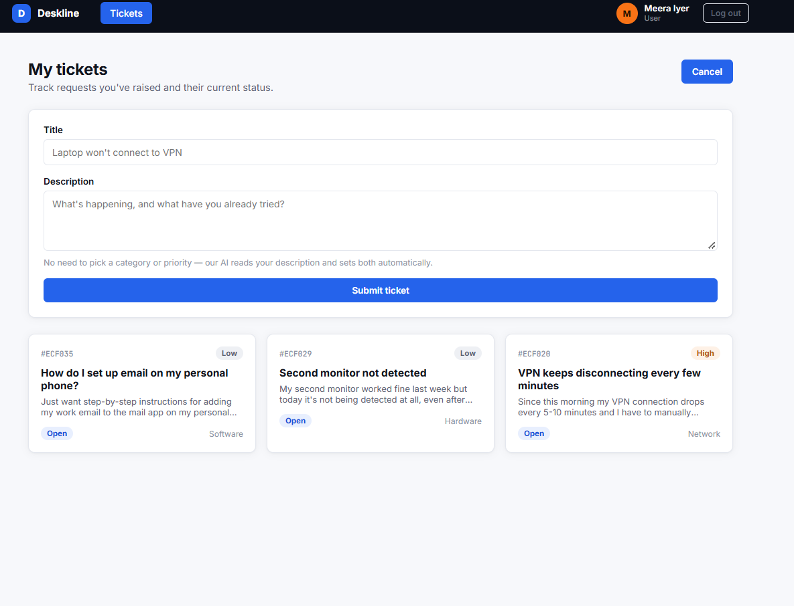
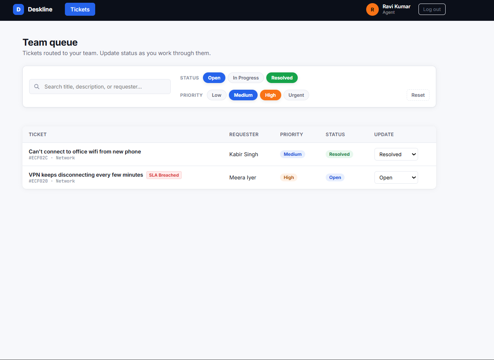
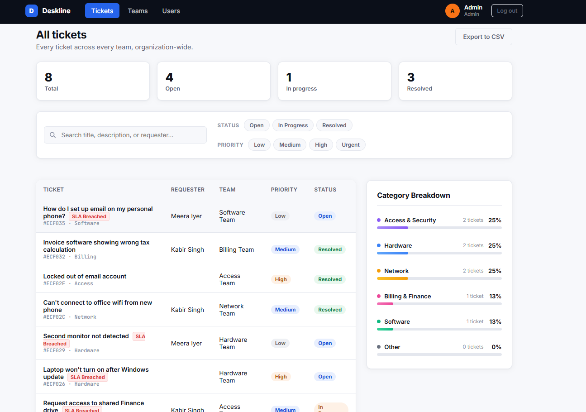
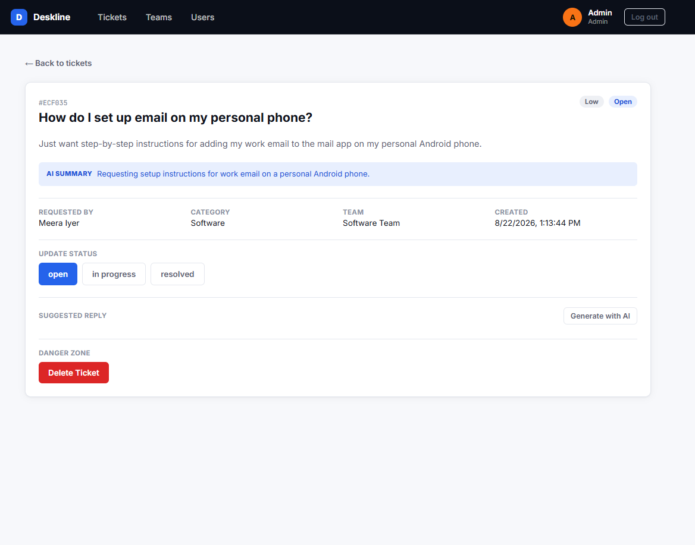
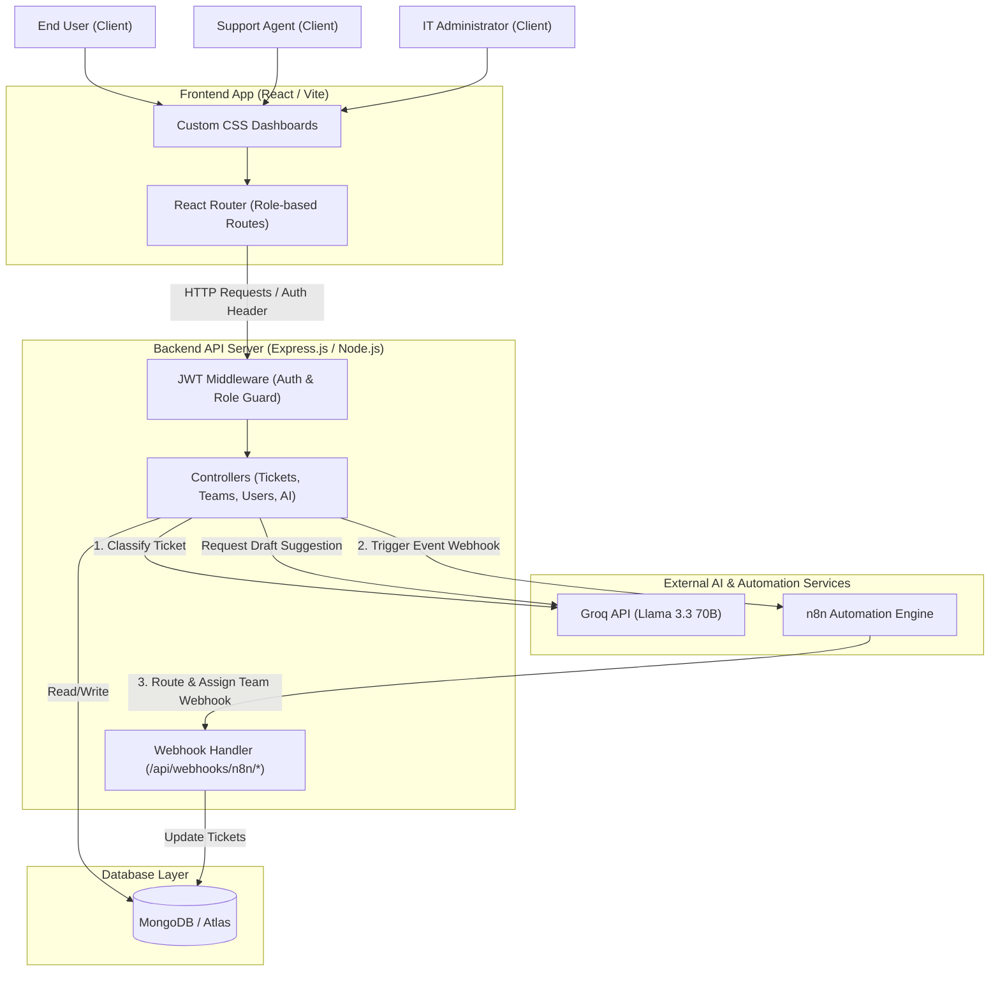
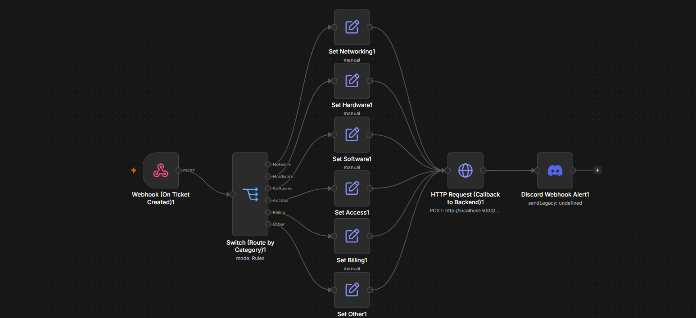
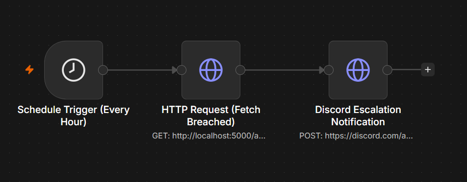

<h1 align="center">
  Deskline — Intelligent IT Helpdesk &amp; Automation Platform
</h1>

<p align="center">
  <strong>A full-stack MERN application featuring AI-powered ticket triage, visual n8n workflow automation, and a premium glassmorphic dark-mode UI.</strong>
</p>

<p align="center">
  
  
  
  
  
</p>


## Project Overview

**Deskline** is a production-grade IT Helpdesk Ticketing System that solves real-world support operations problems. In traditional support environments, three bottlenecks consistently slow resolution times:

| Problem | Manual Approach | Deskline Solution |
| :--- | :--- | :--- |
| **Slow Triage** | A coordinator reads every ticket and manually routes it | **Groq AI (Llama 3.3 70B)** instantly classifies category, priority & generates a summary |
| **Repetitive Drafts** | Agents type the same generic responses from scratch | **AI Draft Generator** creates professional, context-aware replies on demand |
| **SLA Violations** | Urgent tickets buried in queues go unnoticed | **Real-time SLA badges** surface breached tickets automatically on every dashboard |

This project demonstrates a complete software engineering skillset: full-stack REST API design, AI/LLM integration, visual workflow automation, JWT security, RBAC middleware, and modern reactive front-end development.

---

## Live Demo & Screenshots

> **Instructions:** Save your screenshots in a `screenshots/` folder at the project root. The filenames are referenced below.

### Web Application — Main Dashboard

<!-- Add your main application screenshot below -->
<!-- Save screenshot to: screenshots/app-dashboard.png -->


---

### User Dashboard — Submit & Track Tickets

<!-- Add your user dashboard screenshot below -->
<!-- Save screenshot to: screenshots/user-dashboard.png -->



---

### Agent Dashboard — Team Queue & AI Reply Drafts

<!-- Add your agent dashboard screenshot below -->
<!-- Save screenshot to: screenshots/agent-dashboard.png -->



---

### Admin Dashboard — Full System Control

<!-- Add your admin dashboard screenshot below -->
<!-- Save screenshot to: screenshots/admin-dashboard.png -->



---

### Ticket Detail — AI Summary, SLA Badge & Status Management

<!-- Add your ticket detail page screenshot below -->
<!-- Save screenshot to: screenshots/ticket-detail.png -->



---

## Core Features & Capabilities

### AI-Powered Ticket Triage (Zero Human Input Required)
- On ticket submission, the **Groq API (Llama 3.3 70B)** is called with a structured prompt
- The model returns a strict JSON object containing:
  - `category` — one of: `network`, `hardware`, `software`, `access`, `billing`, `other`
  - `priority` — one of: `low`, `medium`, `high`, `urgent`
  - `summary` — a 20-word professional digest of the ticket content
- Uses **low temperature (0.2)** for consistent, deterministic output
- **Graceful degradation**: if Groq is unavailable, defaults to `category: "other"`, `priority: "medium"` — the app never crashes

### Event-Driven Team Routing via n8n
- After AI classification, the backend **asynchronously fires a webhook** to n8n (non-blocking — the user gets their success response instantly)
- n8n reads the ticket category, switches to the correct routing branch, and calls back the backend's secure webhook endpoint to assign the ticket to the correct team
- Team assignment rules live in **n8n, not in source code**, making them changeable without redeployment

### Role-Based Access Control (RBAC) — 3-Tier
- **Users**: Create and track their own tickets
- **Agents**: See only their assigned team's queue; update status; use AI drafts
- **Admins**: Full system control — manage users, teams, roles, and all tickets

### Dynamic SLA Tracking
- Priority-based resolution deadlines are enforced automatically:
  - `urgent` → 2 hours | `high` → 4 hours | `medium` → 24 hours | `low` → 72 hours
- An SLA breach badge is shown on tickets that have exceeded their deadline
- A dedicated `/api/tickets/breached` endpoint lets external monitors poll for breaches

### Premium Glassmorphic Dark-Mode UI
- 100% custom CSS — no Tailwind, no Bootstrap
- Glassmorphic card effects, smooth gradient backgrounds, and micro-animations
- Fully responsive grid layouts for all screen sizes
- Modern typography using Inter and system font stacks

### Advanced Ticket Filtering & Search
- Search by keyword across ticket titles
- Filter by `status`, `priority`, and `category` simultaneously
- Role-aware: agents only see their team's tickets; admins see all

### Category Analytics Widget
- Visual breakdown of tickets by category on the admin dashboard
- Helps identify which teams are under the most load at a glance

---

## System Architecture

Deskline is built on a **3-tier architecture** integrating external LLM and automation services.



### End-to-End Ticket Creation Flow

```
[1] User submits a ticket via React UI
       |
       v
[2] POST /api/tickets — JWT middleware validates identity & role
       |
       v
[3] ticketController.js calls groqService.js
       |─────────────────► Groq API (Llama 3.3 70B)
       |◄──── Returns { category, priority, summary }
       |
       v
[4] Ticket saved to MongoDB with AI metadata
       |
       v
[5] Async fire-and-forget POST to n8n webhook (non-blocking)
       |
       v
[6] 201 Created response returned to UI immediately
       |
[~]  n8n workflow runs in background:
       |  Switch on category → Set teamName → POST /api/webhooks/n8n/assign-team
       v
[7] Ticket updated in MongoDB with assigned support team
```

> **Why async?** Step 5 does **not** use `await`. The user gets their success response in ~300ms (Groq latency) without waiting for n8n's round-trip. This is a critical production pattern for resilient integrations.

---

## n8n Automation Workflows

The n8n integration is **bidirectional** — the backend calls n8n, and n8n calls back the backend.

### Workflow 1 — Ticket Routing Workflow

<!-- Add your n8n ticket routing workflow screenshot below -->
<!-- Save screenshot to: screenshots/n8n-workflow-routing.png -->



**Nodes in this workflow:**

| # | Node | Type | Purpose |
| :---: | :--- | :--- | :--- |
| 1 | **Ticket Created Webhook** | Webhook Trigger | Listens for `POST /ticket-created` from the backend |
| 2 | **Route by Category** | Switch (v3.2+) | Reads `$json.body.category` and branches to the correct team path |
| 3–8 | **Set — [Team Name]** | Set Node (v3.4+) | Sets `teamName` to the correct string per branch |
| 9 | **Assign Team Callback** | HTTP Request | `POST`s back to `/api/webhooks/n8n/assign-team` with `x-api-key` header |

**Payload sent from backend to n8n:**
```json
{
  "id": "60d5ec4b8f1a2c3a4c5e6f7d",
  "title": "WiFi is down on the 3rd floor",
  "category": "network",
  "priority": "high"
}
```

**Switch Node Category to Team Mapping:**

| Category Value | Output Branch | Team Name Assigned |
| :--- | :---: | :--- |
| `network` | Branch 0 | `Network Team` |
| `hardware` | Branch 1 | `Hardware Team` |
| `software` | Branch 2 | `Software Team` |
| `access` | Branch 3 | `Access Team` |
| `billing` | Branch 4 | `Billing Team` |
| `other` | Branch 5 (fallback) | `General Support` |

**Callback payload sent from n8n to backend:**
```json
{
  "ticketId": "{{ $json.ticketId }}",
  "teamName": "{{ $json.teamName }}"
}
```

---

### Workflow 2 — SLA Breach Monitoring Workflow

<!-- Add your n8n SLA monitoring workflow screenshot below -->
<!-- Save screenshot to: screenshots/n8n-workflow-sla.png -->



**Purpose:** A scheduled workflow that periodically polls the backend's `/api/tickets/breached` endpoint and can trigger alerts (e.g., Slack/email notifications) for any SLA-breached tickets.

**Nodes in this workflow:**

| # | Node | Type | Purpose |
| :---: | :--- | :--- | :--- |
| 1 | **Schedule Trigger** | Cron / Interval | Fires every 30 minutes |
| 2 | **Fetch Breached Tickets** | HTTP Request | `GET /api/tickets/breached` |
| 3 | **Check if Results Exist** | IF Node | Checks if any breached tickets were returned |
| 4 | **Send Alert** | Slack / Email / Webhook | Notifies on-call team with ticket details |

---

## AI Integration — Groq / Llama 3.3

### How Classification Works

The `groqService.js` sends the following structured prompt to the API:

```
You are an IT helpdesk triage assistant. Analyze this support ticket and respond 
ONLY with a valid JSON object in this exact format:
{
  "category": "<network|hardware|software|access|billing|other>",
  "priority": "<low|medium|high|urgent>",
  "summary": "<20 word professional summary of the issue>"
}

Ticket Title: [user title]
Ticket Description: [user description]
```

**Key engineering choices:**
- **Temperature: 0.2** — Forces nearly deterministic, schema-compliant output
- **JSON.parse with try/catch** — If the model returns malformed output, a fallback object is used, ensuring the application never throws an unhandled exception
- **Non-blocking to the user** — Classification runs before the DB save (synchronously), but the n8n webhook fires after (asynchronously)

### How AI Reply Drafting Works

When an agent clicks "Suggest Reply," a `POST /api/ai/tickets/:id/suggest-reply` request is made. The controller:
1. Fetches the ticket's full history and priority
2. Sends a prompt to Groq asking it to draft a professional, empathetic response
3. Returns the draft text for the agent to review and optionally edit before sending

---

## System Roles & Access Control (RBAC)

RBAC is enforced at the **middleware level** (`protect`, `restrictTo` middleware functions) on every route — not in the front-end.

| Feature / Capability | User | Agent | Admin |
| :--- | :---: | :---: | :---: |
| Sign up / Login | Yes | Yes | Yes |
| Create support tickets | Yes | Yes | Yes |
| View own tickets | Yes | Yes | Yes |
| View team-assigned ticket queue | No | Yes (own team only) | Yes (all teams) |
| Use AI reply draft generator | No | Yes | Yes |
| Update ticket status / add notes | No | Yes (own team only) | Yes (all tickets) |
| Delete support tickets | No | No | Yes |
| Create & manage support teams | No | No | Yes |
| Promote / demote user roles | No | No | Yes |
| Assign agents to teams | No | No | Yes |
| View category analytics widget | No | No | Yes |

---

## Tech Stack & Key Design Decisions

| Layer | Technology | Why |
| :--- | :--- | :--- |
| **Frontend** | React 18 + Vite | Fast HMR, modern JSX, lightweight bundle |
| **Styling** | Vanilla CSS (Custom) | Full control over glassmorphic effects; no utility-class overhead |
| **Backend** | Node.js + Express.js | Minimal, unopinionated REST API framework |
| **Database** | MongoDB + Mongoose | Flexible schema for evolving ticket fields; Atlas for cloud hosting |
| **Auth** | JWT (jsonwebtoken) | Stateless authentication; role claims embedded in token payload |
| **AI / LLM** | Groq API (Llama 3.3 70B) | Fastest LLM inference available; free tier generous enough for demos |
| **Automation** | n8n (self-hosted / cloud) | Visual no-code routing; changeable without code deploys |
| **Deployment** | Render (API) + Vercel (SPA) | Free-tier friendly; zero-config for Node.js and Vite respectively |

### Notable Engineering Decisions

- **Single `getTickets` controller for all roles** — Rather than separate `/user`, `/agent`, `/admin` endpoints, one controller reads `req.user.role` and applies inline MongoDB query filters. This reduces API surface area and eliminates duplicate code.
- **Async n8n webhook (fire-and-forget)** — The n8n call is intentionally not awaited. Response time stays under 500ms regardless of n8n latency.
- **Webhook security via `x-api-key`** — System-to-system calls from n8n carry a shared secret verified by Express middleware, keeping the public internet from calling internal endpoints.
- **Groq fallback pattern** — The `try/catch` around the Groq call always falls back gracefully, making the AI an enhancement rather than a dependency.

---

## Project File Structure

```
helpdesk-system/
├── backend/
│   ├── config/
│   │   └── db.js                  # MongoDB connection setup
│   ├── controllers/
│   │   ├── aiController.js        # Groq suggest-reply endpoint
│   │   ├── authController.js      # Login / signup / profile
│   │   ├── teamController.js      # CRUD for support teams
│   │   ├── ticketController.js    # Core ticket logic + AI triage + n8n trigger
│   │   └── userController.js      # Admin user management
│   ├── middleware/
│   │   ├── authMiddleware.js      # JWT protect + restrictTo role guard
│   │   └── webhookAuth.js         # x-api-key verification for n8n callbacks
│   ├── models/
│   │   ├── Team.js                # Team schema (name, members)
│   │   ├── Ticket.js              # Ticket schema (title, desc, AI fields, SLA, team)
│   │   └── User.js                # User schema (email, password hash, role, team)
│   ├── routes/
│   │   ├── aiRoutes.js
│   │   ├── authRoutes.js
│   │   ├── teamRoutes.js
│   │   ├── ticketRoutes.js
│   │   ├── userRoutes.js
│   │   └── webhookRoutes.js       # n8n callback endpoint
│   ├── services/
│   │   └── groqService.js         # Groq API call + prompt + JSON parse + fallback
│   ├── seed.js                    # Seeds admin user + 6 default support teams
│   └── server.js                  # Express app entry point + CORS + route mounting
│
├── frontend/
│   └── src/
│       ├── components/
│       │   ├── CategoryAnalytics.jsx   # Ticket breakdown bar chart (Admin)
│       │   ├── Navbar.jsx              # Role-aware navigation bar
│       │   ├── PrivateRoute.jsx        # Route guard wrapper
│       │   ├── SearchFilterBar.jsx     # Multi-filter search bar
│       │   ├── StatusBadge.jsx         # Colored status pill component
│       │   └── TicketCard.jsx          # Individual ticket summary card
│       ├── context/
│       │   └── AuthContext.jsx         # Global auth state (user, token, logout)
│       ├── pages/
│       │   ├── AdminDashboard.jsx      # Full admin control panel
│       │   ├── AgentDashboard.jsx      # Team queue view for agents
│       │   ├── Login.jsx               # Login page
│       │   ├── ManageTeams.jsx         # Admin: create/edit/delete teams
│       │   ├── ManageUsers.jsx         # Admin: assign roles & teams to users
│       │   ├── Signup.jsx              # Registration page
│       │   ├── TicketDetail.jsx        # Full ticket view with AI reply
│       │   └── UserDashboard.jsx       # End-user ticket list + create form
│       ├── utils/
│       │   └── api.js                  # Axios instance with base URL + auth header
│       ├── App.jsx                     # Router setup + role-based route protection
│       ├── index.css                   # Full custom CSS design system (22KB)
│       └── main.jsx                    # React root + AuthProvider wrapper
│
├── screenshots/                        # Add your screenshots here
│   ├── app-dashboard.png
│   ├── user-dashboard.png
│   ├── agent-dashboard.png
│   ├── admin-dashboard.png
│   ├── ticket-detail.png
│   ├── n8n-workflow-routing.png        # Ticket routing n8n workflow diagram
│   └── n8n-workflow-sla.png            # SLA monitor n8n workflow diagram
│
├── EXPLANATION.md                      # Deep-dive architecture & interview guide
└── README.md                           # This file
```

---

## API Reference

All routes require `Authorization: Bearer <JWT>` unless marked **Public** or **API-Key Protected**.

### Authentication — `/api/auth`

| Method | Endpoint | Access | Description |
| :---: | :--- | :--- | :--- |
| `POST` | `/signup` | Public | Register a new user (default role: `user`) |
| `POST` | `/login` | Public | Authenticate user, returns signed JWT |
| `GET` | `/me` | Any (authenticated) | Retrieve logged-in user's profile |

### Tickets — `/api/tickets`

| Method | Endpoint | Access | Description |
| :---: | :--- | :--- | :--- |
| `POST` | `/` | Any (authenticated) | Create ticket — triggers AI classification + n8n webhook |
| `GET` | `/` | Any (authenticated) | List tickets (role-filtered: own / team / all) |
| `GET` | `/breached` | Public | Returns tickets that have exceeded SLA deadline |
| `GET` | `/:id` | Any (authenticated) | View full ticket details |
| `PATCH` | `/:id` | Agent / Admin | Update status, priority, notes |
| `DELETE` | `/:id` | Admin only | Remove a ticket permanently |

### Teams — `/api/teams` (Admin Only)

| Method | Endpoint | Description |
| :---: | :--- | :--- |
| `POST` | `/` | Create a support team |
| `GET` | `/` | List all teams |
| `GET` | `/:id` | Get team details |
| `PATCH` | `/:id` | Modify team |
| `DELETE` | `/:id` | Remove team |

### Users — `/api/users` (Admin Only)

| Method | Endpoint | Description |
| :---: | :--- | :--- |
| `GET` | `/` | List all registered users |
| `PATCH` | `/:id` | Update user role or team assignment |
| `DELETE` | `/:id` | Delete a user |

### Webhooks — `/api/webhooks` (API-Key Protected)

| Method | Endpoint | Description |
| :---: | :--- | :--- |
| `POST` | `/n8n/assign-team` | Called by n8n to assign a team to a ticket |

### AI — `/api/ai` (Agent / Admin Only)

| Method | Endpoint | Description |
| :---: | :--- | :--- |
| `POST` | `/tickets/:id/suggest-reply` | Generate an AI draft reply for a ticket |

---

## SLA Tracking Logic

SLA deadlines are computed dynamically based on ticket priority and creation timestamp:

```javascript
const SLA_HOURS = { urgent: 2, high: 4, medium: 24, low: 72 };

function isBreached(ticket) {
  const deadline = new Date(ticket.createdAt);
  deadline.setHours(deadline.getHours() + SLA_HOURS[ticket.priority]);
  return new Date() > deadline && ticket.status !== 'resolved';
}
```

- Breached tickets surface a **SLA Breach** badge on the dashboard
- The `/api/tickets/breached` endpoint can be polled by external monitoring tools or the n8n SLA workflow

---

## Environment Configuration

### Backend — `backend/.env`
```env
PORT=5000
MONGO_URI=mongodb+srv://<user>:<password>@cluster.mongodb.net/helpdesk
JWT_SECRET=your_super_secret_jwt_string_here
JWT_EXPIRES_IN=7d
CLIENT_URL=http://localhost:5173

# AI Integration
GROQ_API_KEY=your_groq_api_key_from_console.groq.com

# n8n Automation
N8N_API_KEY=your_secure_random_key_for_webhook_auth
N8N_WEBHOOK_URL=http://localhost:5678/webhook/ticket-created
```

### Frontend — `frontend/.env`
```env
VITE_API_URL=http://localhost:5000/api
```

---

## Local Development Setup

### Prerequisites
- **Node.js** v18+
- **MongoDB** (local instance or Atlas free tier)
- **n8n** (self-hosted via `npx n8n` or cloud at n8n.cloud)
- **Groq API Key** — free at [console.groq.com](https://console.groq.com)

### Step 1 — Install Dependencies
```bash
# Backend
cd backend && npm install

# Frontend
cd ../frontend && npm install
```

### Step 2 — Configure Environment Variables
Copy the env templates above into `backend/.env` and `frontend/.env` and fill in your values.

### Step 3 — Seed the Database
Creates the default admin account (`admin@deskline.com` / `admin123`) and the 6 pre-configured support teams:
```bash
cd backend
node seed.js
```

### Step 4 — Run Development Servers
```bash
# Terminal 1 — Backend API (http://localhost:5000)
cd backend && npm run dev

# Terminal 2 — Frontend UI (http://localhost:5173)
cd frontend && npm run dev
```

### Step 5 — Configure n8n Workflow
1. Start n8n: `npx n8n` (available at `http://localhost:5678`)
2. Create a new workflow and add a **Webhook** node — set path to `ticket-created`
3. Copy the **Test URL** and paste it into `backend/.env` as `N8N_WEBHOOK_URL`
4. Add a **Switch** node reading `{{ $json.body.category }}` with the 6 routing branches
5. Add a **Set** node per branch setting `teamName` to the exact team name string
6. Connect all Set nodes to a single **HTTP Request** node that calls back `POST http://localhost:5000/api/webhooks/n8n/assign-team` with header `x-api-key: <your N8N_API_KEY>`

---

## Production Deployment

### MongoDB Atlas
1. Create a free M0 cluster at [mongodb.com/atlas](https://www.mongodb.com/cloud/atlas)
2. Add `0.0.0.0/0` to Network Access (or your backend's static IP)
3. Create a DB user with read/write access
4. Copy your connection string to `MONGO_URI`

### Backend — Render
1. Create a **Web Service** connected to your GitHub repo
2. Set **Root Directory** to `backend`
3. **Build Command**: `npm install` | **Start Command**: `npm start`
4. Add all backend environment variables in Render's Settings tab
5. Copy the deployed URL (e.g., `https://deskline-api.onrender.com`)

### Frontend — Vercel
1. Import your GitHub repo on Vercel
2. Set **Root Directory** to `frontend`
3. Framework Preset: **Vite** | Build: `npm run build` | Output: `dist`
4. Add environment variable: `VITE_API_URL=https://deskline-api.onrender.com/api`
5. After deploy, paste your Vercel URL into `CLIENT_URL` on your Render backend

---

## Interview Q&A Cheatsheet

**Q: Why use n8n instead of routing teams directly in Node.js?**
> *"Separating routing logic from application code enables non-developers to change assignment rules visually. If a team splits or a new escalation path is needed (e.g., page on-call via PagerDuty for urgent tickets), a manager can update the n8n flowchart in minutes without a code deploy or hotfix."*

**Q: How does AI ticket classification work?**
> *"On ticket creation, the backend sends the title and description to Groq's Llama-3.3-70B via the chat completions API. A low temperature of 0.2 forces consistent, schema-compliant JSON output. We parse the response and fall back to safe defaults if the model returns malformed output, ensuring the application is resilient to LLM failures."*

**Q: How are routes secured across all three roles?**
> *"Authentication uses JWT tokens stored in localStorage and sent in the Authorization header. The `protect` middleware decodes the token and attaches the user to `req.user`. The `restrictTo(...roles)` middleware factory then guards any route by checking `req.user.role` against the allowed roles list."*

**Q: Why is the n8n webhook called asynchronously?**
> *"To keep the user-facing response fast. The ticket creation success response is returned to the client immediately after the MongoDB write. The n8n call is fire-and-forget — if n8n is slow or temporarily down, the user experience is unaffected. Team assignment happens in the background."*

**Q: How do you prevent anyone from calling the n8n callback endpoint?**
> *"The `/api/webhooks/n8n/assign-team` endpoint is protected by a custom Express middleware that validates an `x-api-key` header. Only n8n (which has the key set as a header parameter in its HTTP Request node) can successfully call this endpoint."*

**Q: What happens if Groq is down when a ticket is submitted?**
> *"The `groqService.js` wraps the API call in a try/catch. On failure, it logs a warning and returns a fallback object (`category: 'other'`, `priority: 'medium'`, `summary: 'AI classification unavailable'`). The ticket is still created and saved successfully — the AI is an enhancement, not a hard dependency."*

---

<p align="center">Built by <strong>Prajwal</strong> — demonstrating end-to-end full-stack engineering with AI and automation integration.</p>
