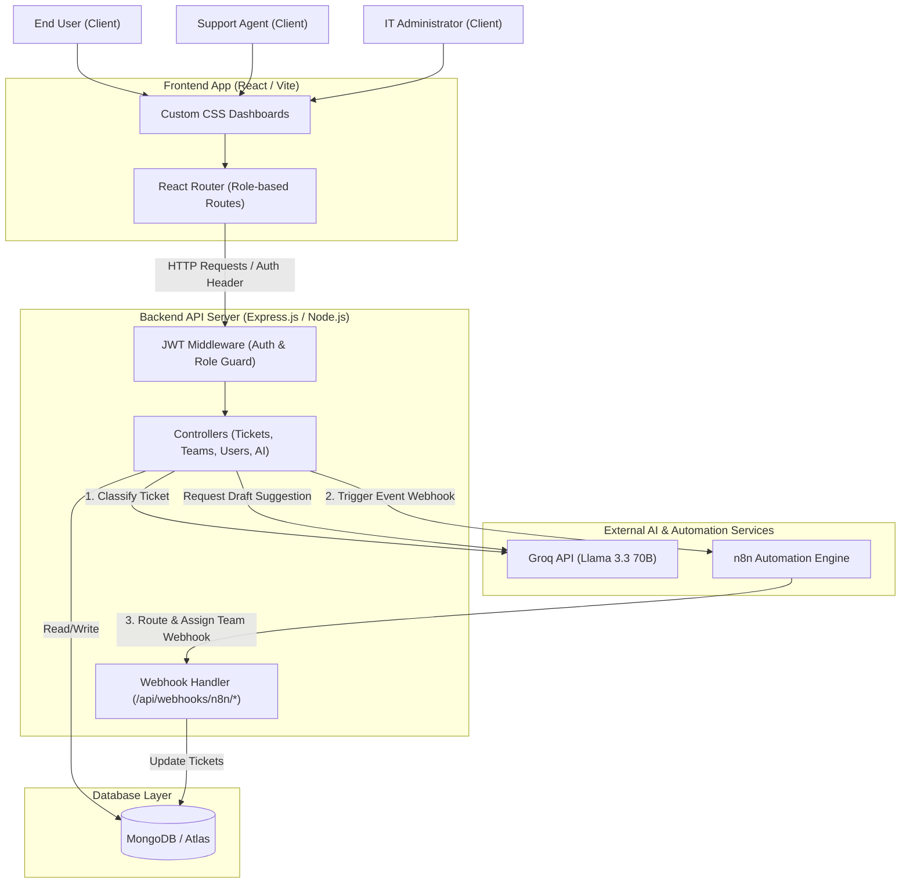

# Deskline — Intelligent IT Helpdesk & Automation Platform

Deskline is an interview-ready, full-stack IT Helpdesk Ticketing System built using the **MERN (MongoDB, Express, React, Node.js)** stack. It is engineered with robust role-based access control, AI-driven ticket triage powered by the **Groq API (Llama 3.3 70B)**, and event-driven team routing automated via the **n8n Automation Engine**.

The entire user interface is designed with a premium, custom glassmorphic dark-mode CSS theme featuring rich interactive animations, modern typography, and responsive grid layouts.

---

## 🏗️ System Architecture

Deskline employs a 3-tier architecture integrated with external LLM services and visual automation workflows.



### Flow of Operations
1. **Ticket Creation**: A user submits a ticket.
2. **AI Classification**: The backend intercepts the creation, queries **Groq API** with a low temperature (0.2) prompt, and receives structured JSON with predicted `category`, `priority`, and a 20-word AI `summary`.
3. **Save**: The ticket is saved to MongoDB.
4. **n8n Automation Webhook**: The backend sends a payload asynchronously to n8n.
5. **Team Assignment Callback**: The n8n workflow routes the ticket to the correct support team based on category/priority, making a secure HTTP request back to the backend's `/api/webhooks/n8n/assign-team` webhook authenticated with `x-api-key`.

---

## 📷 Screenshots

*Please place the screenshot images in a directory named `screenshots/` at the root of the project.*

### Web Application Dashboard
> [!NOTE]
> Space reserved for the Helpdesk app interface. Drag and drop your application screenshot here.


### n8n Automation Workflow
> [!NOTE]
> Space reserved for the n8n automation workflow. Drag and drop your n8n workflow screenshot here.


---

## 👥 System Roles & Capabilities

Deskline handles routing logically inside a unified state machine rather than scattering conditions across distinct API endpoints:

| Feature / Capability | User Role | Agent Role | Admin Role |
| :--- | :---: | :---: | :---: |
| Create support tickets | Yes | Yes | Yes |
| View own tickets | Yes | Yes (if owner) | Yes (if owner) |
| View team-assigned tickets | No | Yes (assigned team only) | Yes (all teams) |
| Suggest AI reply drafts | No | Yes | Yes |
| Manage ticket status / fields | No | Yes (assigned team only) | Yes (all tickets) |
| Delete support tickets | No | No | Yes |
| Create & manage support teams | No | No | Yes |
| Promote/demote users & roles | No | No | Yes |

---

## 🔗 API Reference

All routes require a valid JSON Web Token (`Authorization: Bearer <JWT>`) unless specified as **Public** or **API-Key Protected**.

### Authentication (`/api/auth`)
* `POST /signup` (Public) - Create a new user (defaults to `role: "user"`).
* `POST /login` (Public) - Login with email and password, returns JWT.
* `GET /me` - Retrieve current logged-in user profile.

### Tickets (`/api/tickets`)
* `POST /` - Create a ticket (Triggers Groq classification and fires n8n webhook).
* `GET /` - List tickets (Role-aware filtering).
* `GET /breached` (Public/API-Key) - List tickets breaching their SLA target.
* `GET /:id` - View individual ticket details.
* `PATCH /:id` (Agent/Admin) - Update ticket fields (status, notes, manual category).
* `DELETE /:id` (Admin only) - Remove a ticket.

### Teams (`/api/teams`) (Admin Only)
* `POST /` - Create a support team.
* `GET /` - List all support teams.
* `GET /:id` - Retrieve individual team details.
* `PATCH /:id` - Modify team details.
* `DELETE /:id` - Remove a support team.

### User Management (`/api/users`) (Admin Only)
* `GET /` - List all users registered in the system.
* `PATCH /:id` - Update user role (`user`/`agent`/`admin`) or team assignment.
* `DELETE /:id` - Delete a user.

### Webhooks (`/api/webhooks`) (API-Key Protected)
* `POST /n8n/assign-team` - Endpoint for n8n to call back and assign a ticket to a support team based on name.

### AI Suggestions (`/api/ai`) (Agent/Admin Only)
* `POST /tickets/:id/suggest-reply` - Hits Groq to draft a professional response based on ticket priority and history.

---

## 🛠️ Environment Configuration

### Backend variables (`backend/.env`)
Create a file at `backend/.env` with the following configuration:
```env
PORT=5000
MONGO_URI=your_mongodb_connection_string
JWT_SECRET=your_super_secret_jwt_string
JWT_EXPIRES_IN=7d
CLIENT_URL=http://localhost:5173
GROQ_API_KEY=your_groq_llama3_api_key

# n8n Automation Credentials
N8N_API_KEY=your_secure_random_key_for_webhooks
N8N_WEBHOOK_URL=http://localhost:5678/webhook/ticket-created
```

### Frontend variables (`frontend/.env`)
Create a file at `frontend/.env` with the following configuration:
```env
VITE_API_URL=http://localhost:5000/api
```

---

## 🚀 Local Development Setup

### Prerequisite Checklist
* **Node.js** (v18+)
* **MongoDB** (Local instance or Atlas cloud cluster)
* **n8n** (Self-hosted or Cloud account)
* **Groq API Key** (Obtained from Groq Console)

### Step 1: Install Dependencies
```bash
# Install backend packages
cd backend
npm install

# Install frontend packages
cd ../frontend
npm install
```

### Step 2: Seed the Database
Create initial admin user (`admin@deskline.com` / `admin123`) and sample support teams:
```bash
cd ../backend
node seed.js
```

### Step 3: Run Development Servers
```bash
# Start backend server (runs on Port 5000)
cd backend
npm run dev

# Start frontend development server (runs on Port 5173)
cd ../frontend
npm run dev
```

---

## 🤖 n8n Workflow Automation Setup

The connection with n8n is bidirectional. To set this up:

1. **Trigger Webhook inside n8n**:
   - Create a **Webhook Node** in n8n.
   - Set HTTP Method to `POST`.
   - Set the Path to `/ticket-created`.
   - Copy the Production or Test webhook URL and paste it as `N8N_WEBHOOK_URL` in your backend `.env`.

2. **Routing Switch Node**:
   - Add a **Switch Node** reading `{{ $json.category }}`.
   - Set up route rules mapping category values:
     * `hardware` ➔ `"Hardware Team"`
     * `software` ➔ `"Software Team"`
     * `network` ➔ `"Network Team"`
     * `access` ➔ `"Security & Access Team"`
     * `billing` ➔ `"Billing & Finance Team"`
     * `other` ➔ `"General Support Team"`

3. **Callback HTTP Request Node**:
   - Add an **HTTP Request Node** to send a payload back to the backend.
   - Set URL to `https://<YOUR_BACKEND_URL>/api/webhooks/n8n/assign-team`.
   - Method: `POST`.
   - Headers: Add `x-api-key` with the value set to your backend's `N8N_API_KEY`.
   - Body:
     ```json
     {
       "ticketId": "{{ $json.id }}",
       "teamName": "YOUR_ROUTED_TEAM_NAME"
     }
     ```

---

## 🌐 Production Deployment Guide

Follow this guide to move the Deskline project to production servers.

### 📦 1. Database Setup (MongoDB Atlas)
1. Register on [MongoDB Atlas](https://www.mongodb.com/cloud/atlas).
2. Create a free M0 Cluster.
3. Under **Network Access**, add IP address `0.0.0.0/0` (or the static IPs of your backend servers).
4. Under **Database Access**, create a user with read/write credentials.
5. Retrieve your connection string (looks like `mongodb+srv://<username>:<password>@cluster.mongodb.net/helpdesk?retryWrites=true&w=majority`).

### ⚙️ 2. Deploy Backend API
The backend works seamlessly on platforms like **Render**, **Railway**, or **Heroku**.

#### Render Deployment Steps:
1. Log in to Render and create a new **Web Service**.
2. Connect your Git repository.
3. Configure the settings:
   - **Environment**: `Node`
   - **Build Command**: `npm install` (Root directory: `backend`)
   - **Start Command**: `npm start`
4. Add the **Environment Variables** in Render's settings tab:
   - `MONGO_URI`: (Your MongoDB Atlas connection string)
   - `JWT_SECRET`: (A secure cryptographic key)
   - `JWT_EXPIRES_IN`: `7d`
   - `CLIENT_URL`: (Your frontend production URL, e.g., `https://deskline.vercel.app`)
   - `GROQ_API_KEY`: (Your production Groq API Key)
   - `N8N_API_KEY`: (Your secure webhook authorization token)
   - `N8N_WEBHOOK_URL`: (Your active n8n production webhook URL)
5. Save and deploy. Copy the deployed Web Service URL (e.g., `https://deskline-api.onrender.com`).

### 💻 3. Deploy Frontend SPA
The frontend can be static-hosted on platforms like **Vercel** or **Netlify**.

#### Vercel Deployment Steps:
1. Log in to Vercel and import your Git project.
2. Select the `frontend` subdirectory as the **Root Directory**.
3. In **Build & Development Settings**, configure:
   - **Framework Preset**: `Vite`
   - **Build Command**: `npm run build`
   - **Output Directory**: `dist`
4. Add the following **Environment Variable**:
   - `VITE_API_URL`: `https://deskline-api.onrender.com/api` (Make sure it points to your production backend URL with `/api` suffix, without a trailing slash).
5. Deploy. Paste your resulting frontend URL into your Backend **CLIENT_URL** environment variable so CORS permits requests.
